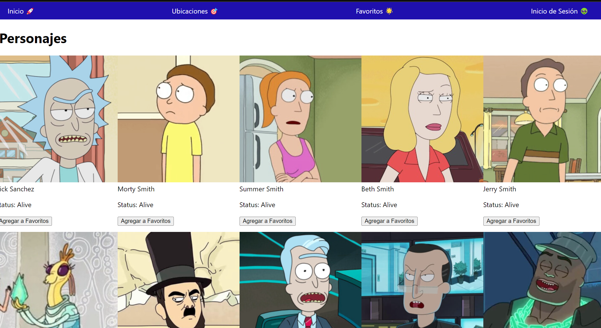

<h1 align="center">Prueba Técnica Rick and Morty Fans</h1>

<h4 >
Esto es una prueba técnica para frontend Mid
</h4>

## :hammer: Funcionalidades

REQUISITOS TÉCNICOS
1. Utilizar REACT o Svelte para la construcción de la interfaz de usuario
2.Para gestionar el estado global de la aplicación deberás usar una de las siguientes opciones React Context, los contextos de Svelte o XState
3. El uso de TypeScript es obligatorio
4. En caso de escoger React deberá ser React Vanilla con React Router en caso contrario SvelteKit
5. Implementar un menú de navegación
6. La página de inicio debe mostrar tarjetas de personajes con desplazamiento infinito y la posibilidad de agregar personajes a favoritos.
7. La página de ubicaciones debe mostrar tarjetas de ubicaciones con desplazamiento infinito y la opción de agregar ubicaciones a favoritos.
8. La página de favoritos debe mostrar todos los favoritos combinados y permitir eliminar elementos de la lista.
9. Para añadir un favorito el usuario deberá iniciar sesión en la página de inicio de sesión

## :white_check_mark: Tecnologías
- React
- Typescript
- HTML5
- CSS3
- Bootstrap
- Axios

